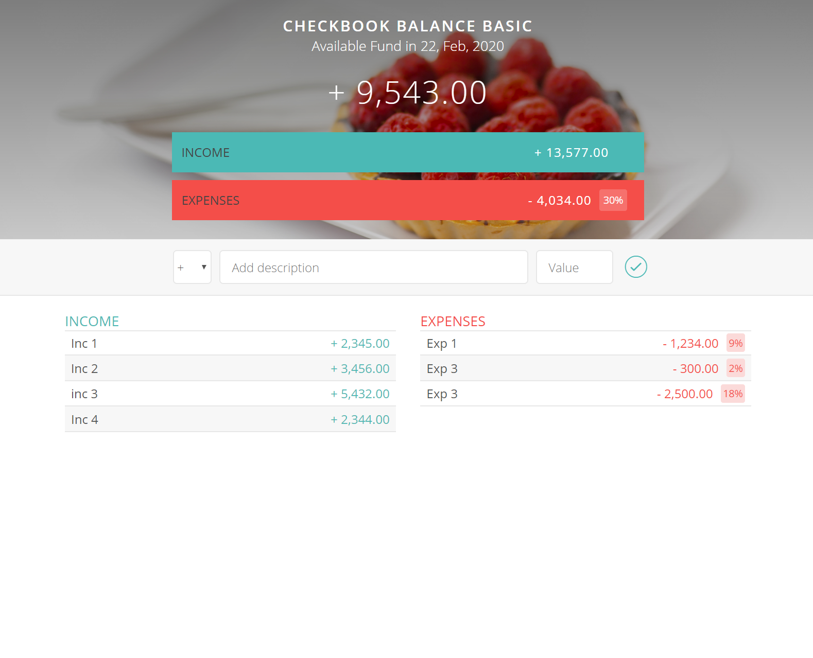

# BASIC CHECKBOOK BALANCE APP
A basic budget management app that will allow user to enter income and expense data.

## Credited Statement
This is one of my homework projects in the fullstack programing bootcamp, the design of the app and training material is from one of the best instructors in the business, in this homework assignment, I am the student and a programmer to perform all of the coding followed the teaching concepts tought in the course.

### Designer/Instructor/Programmer

Course Designer/Instructor/Developer: Jonas Schmedtmann

Student/Programmer: Chris Thanh Nguyen

### What I can do after this training?
After completed the training course, I am able to understand all the concepts and now able to design and code very high quality and most beautifull web/app with realworld features and functionalities. I am confident that with knowledge learned, I am now able to produce many challenging realworld fullstack projects for small business, organizations or personal website.

## View the website
[Click to run](https://monksedo.github.io/budgetBasic/)

## Screenshot 
### Refactor UI code with Flexbox for better UX
